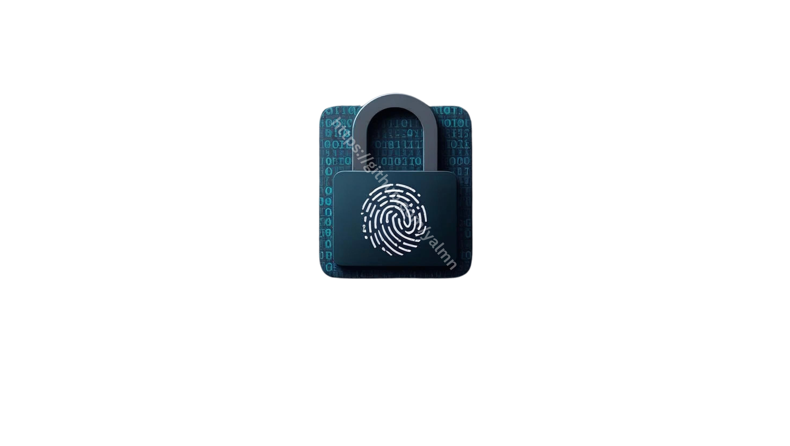

[](LICENSE)

<p align="center">
  
</p>

# ForensiCUnlock

**ForensiCUnlock** ist ein modulares C-Tool zur automatisierten Entschlüsselung forensischer BitLocker-Images. Es erkennt automatisch die relevante Partition, entschlüsselt diese mit `dislocker`, führt die Datenbereiche zusammen und entfernt danach alle temporären Artefakte – ideal für forensische Analysen und kompatibel mit WSL2.

---

## Features

- Automatische Partitionserkennung via `mmls` (NTFS / GPT / BDP)
- Entschlüsselung von BitLocker-Partitionen mit `dislocker`
- Konvertierung von `.E01`/`.ewf` zu RAW via `xmount`
- Zusammenführung der Image-Segmente zu einem vollständigen `.dd`-Image via `cat`
- Automatischer Cleanup – nur das Ziel-Image und Original bleiben erhalten
- Isolierte Ausgabe in `run_<timestamp>` oder benutzerdefiniertem Ordner

---

## Aufbau & Module

| Modul              | Beschreibung                                                           |
| ------------------ | ---------------------------------------------------------------------- |
| `main.c`           | Einstiegspunkt, steuert alle Schritte über Argumente                  |
| `mount_selector`   | Prüft EWF, .dd oder Blockgerät und mountet entsprechend               |
| `image_converter`  | Konvertiert `.E01`/`.ewf` via `xmount` (falls nötig)                  |
| `partition_parser` | Erkennt die BitLocker-BDP mit `mmls`                                  |
| `dislocker_runner` | Entschlüsselt BDP mittels `dislocker` mit dynamischem Offset          |
| `image_merger`     | Führt `cat`-Merge der Teile zu `merged.dd` durch                      |
| `utils`            | Hilfsfunktionen (Verzeichnisse, Cleanup, Zeitstempel etc.)            |

---

## ⚙Installation

### Voraussetzungen (Debian/Kali/WSL2)

```bash
sudo apt update
sudo apt install dislocker ewf-tools sleuthkit xmount make gcc -y
```

### Projekt klonen & kompilieren

```bash
git clone https://github.com/yalmn/ForensiCUnlock.git
cd ForensiCUnlock
make
```

---

## Beispiel: Entschlüsselung

```bash
sudo ./forensic_unlock /pfad/zum/image.E01 "BITLOCKER-KEY" /mnt/output/case01
```

Ablauf:

1. EWF-Image wird automatisch zu RAW konvertiert  
2. Partitionstabelle wird analysiert (mmls + BDP-Erkennung)  
3. BDP wird entschlüsselt  
4. Image-Segmente werden per `cat` zusammengeführt  
5. Temporäre Dateien werden gelöscht  

Ergebnis:
```bash
/mnt/output/case01/
└── merged.dd   # Vollständiges entschlüsseltes Image
```

---

## Optional: Zeitgestempelter Run-Modus

Wird kein Output-Ordner angegeben, erstellt das Tool automatisch:

```bash
/mnt/output/run_YYYYMMDD_HHMM/
└── merged.dd
```

---

## Hinweise

- Root-Rechte erforderlich (`sudo`)
- Getestet unter Linux und **WSL2** (Ubuntu 22.04)
- Unterstützt `.E01` / `.ewf`, RAW-Images (`.dd`) und Blockgeräte (`/dev/sdX`)
- Kein `dmsetup` oder Device-Mapper nötig
- Alle temporären Dateien werden automatisch gelöscht
- Ergebnis ist ein einzelnes entschlüsseltes `.dd`-Image (`merged.dd`)

---

## Lizenz

Dieses Projekt steht unter der [MIT License](LICENSE) © 2025 [yalmn](https://github.com/yalmn/)


## Release-Hinweis

Diese Version (`v1.0.0`) ist die erste stabile Veröffentlichung mit vollständiger Automatisierung des BitLocker-Entschlüsselungsprozesses ohne Abhängigkeit von `dmsetup`. Weitere Features wie automatische Dateiextraktion und forensische Report-Erstellung sind geplant.
