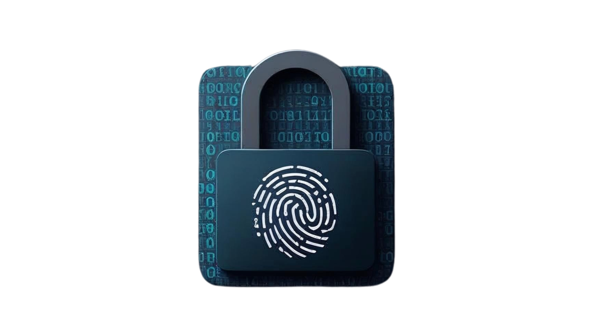

[](LICENSE)

<p align="center">
  
</p>

# ForensiCUnlock

**ForensiCUnlock** ist ein C-Tool für Linux und WSL2, das BitLocker-verschlüsselte Partitionen in forensischen Images entschlüsselt. Am Ende steht nicht nur die entschlüsselte Partition, sondern wieder ein vollständiges Datenträger-Image (`merged.dd`). Partitionstabelle und alle anderen Partitionen bleiben byte-genau erhalten, deshalb lässt sich das Ergebnis direkt in Autopsy, X-Ways oder The Sleuth Kit öffnen.

---

## Features

- Eingabe als RAW-Image (`.dd`, `.raw`, `.img`), EWF-Image (`.E01`, `.Ex01`, `.ewf`), VM-Export (`.ova`) oder Blockgerät (`/dev/sdX`)
- EWF-Images mit beliebig vielen Segmenten (`.E01`, `.E02`, ... `.E99`, `.EAA`, ...), Vollständigkeit wird vorab geprüft
- OVA-Dateien: die enthaltenen VMDK-Disks werden extrahiert und read-only per `qemu-nbd` eingehängt (keine RAW-Vollkopie), mehrere Disks werden alle nach BitLocker durchsucht
- Erkennung der BitLocker-Partition über die Signatur im Volume-Header, unabhängig von Partitionsnamen oder -typ
- GPT und MBR, 512- und 4096-Byte-Sektoren, BitLocker To Go
- Auswahl, wenn mehrere BitLocker-Partitionen im Image liegen
- Entschlüsselung read-only mit `dislocker`, das Original wird nie verändert
- Zusammenführung direkt in eine Datei, ohne Zwischenkopien (Speicherbedarf etwa einmal die Imagegröße)
- Sauberes Aufräumen, auch bei Fehlern oder Abbruch mit Ctrl+C: alle Mounts werden ausgehängt, Hilfsordner entfernt
- Keine Shell-Aufrufe, Pfade und Schlüssel mit Leerzeichen oder Anführungszeichen sind unproblematisch

---

## Ablauf

1. **Abhängigkeiten prüfen:** Vor dem Lauf prüft das Tool, ob alle nötigen Programme (`mmls`, `dislocker`, `dislocker-metadata`, je nach Eingabe `qemu-nbd`/`tar` bzw. `ewfmount`) im `PATH` sind. Fehlt etwas, wird `scripts/install.sh` ausgeführt und erneut geprüft.
2. **Bereitstellen:** Bei `.E01` prüft das Tool die Segmente und hängt das Image mit `ewfmount` als RAW-Datei ein. Bei `.ova` werden die VMDK-Disks aus dem Archiv extrahiert und read-only per `qemu-nbd` als Blockgerät (`/dev/nbdX`) eingehängt.
3. **Partition finden:** `mmls` liest die Partitionstabelle. Jede Partition wird auf die BitLocker-Signatur (`-FVE-FS-` bzw. die BitLocker-GUID bei To Go) geprüft. Bei mehreren OVA-Disks werden alle durchsucht und die Treffer zur Auswahl angeboten.
4. **Kontrolle:** Die gefundene Partition und die komplette Partitionstabelle werden angezeigt. Weiter geht es erst nach ENTER.
5. **Entschlüsseln:** `dislocker` stellt die entschlüsselte Partition read-only als `dislocker-file` bereit.
6. **Metadaten sichern:** `dislocker-metadata` schreibt die (unverschlüsselten) BitLocker-Metadaten (Verschlüsselungsart, Volume-GUID, Protektoren, Offsets) nach `metadata.txt` in den Ausgabeordner.
7. **EOW prüfen:** Bei Volumes mit Encrypt-on-Write liest das Tool die EOW-Bitmap aus dem Original (siehe unten). Sind die EOW-Daten beschädigt, bricht es ab.
8. **Zusammenführen:** `merged.dd` entsteht aus dem Bereich vor der Partition, der entschlüsselten Partition und dem Bereich danach. Bei EOW kommen die nie verschlüsselten Blöcke unverändert aus dem Original.
9. **Aufräumen:** `dislocker` und `ewfmount` werden ausgehängt, `qemu-nbd`-Geräte gelöst, extrahierte VMDKs und Hilfsordner gelöscht.

---

## Aufbau & Module

| Modul              | Aufgabe                                                                 |
| ------------------ | ----------------------------------------------------------------------- |
| `main.c`           | Einstiegspunkt, Argumente, Ablaufsteuerung, Aufräumen und Ctrl+C        |
| `exec_utils`       | Externe Programme ohne Shell starten, Verzeichnisse anlegen, Mounts prüfen und aushängen |
| `image_converter`  | EWF-Segmente prüfen und das Image mit `ewfmount` einhängen              |
| `ova_mounter`      | VMDK-Disks aus einer OVA extrahieren und read-only per `qemu-nbd` einhängen |
| `partition_parser` | `mmls`-Ausgabe auswerten, Sektorgröße lesen, BitLocker-Signatur prüfen  |
| `dislocker_runner` | `dislocker` mit dem passenden Byte-Offset aufrufen                      |
| `image_merger`     | Imagegröße ermitteln und `merged.dd` blockweise schreiben               |

---

## Installation

### Voraussetzungen (Debian, Ubuntu, Kali, WSL2)

```bash
sudo apt update
sudo apt install build-essential dislocker ewf-tools sleuthkit fuse3 qemu-utils -y
```

`qemu-utils` (liefert `qemu-nbd`) wird nur für OVA-Dateien gebraucht. Dafür muss außerdem
das `nbd`-Kernelmodul verfügbar sein; das Tool lädt es bei Bedarf mit `modprobe nbd`.
In einer VM oder auf Blech funktioniert das direkt, in einem Docker-Container nur mit
`--privileged` und Zugriff auf `/dev/nbd*`.

### EOW- / Windows-11-Volumes (neueres dislocker nötig)

Neuere BitLocker-Volumes (Windows 10/11, besonders „nur belegten Speicherplatz
verschlüsseln") nutzen **EOW (Encrypt-On-Write)**. Das Distro-`dislocker` **0.7.2**
bricht bei solchen Volumes mit `EOW volume GUID not supported` / `Cannot parse volume
header` ab. Ein aus dem **git-master** gebautes dislocker (0.7.3, getestet mit
`master:37ceb7b`) öffnet sie, kann die EOW-Informationen aber nicht auswerten
(`get_eow_information::Error` in `metadata.txt`) und entschlüsselt deshalb das ganze
Volume. Bei EOW bleiben jedoch Blöcke im Klartext, die BitLocker nie verschlüsselt hat.
dislocker allein macht sie unbrauchbar. ForensiCUnlock gleicht das aus (siehe
[Encrypt-on-Write](#encrypt-on-write-eow)). Für normale BitLocker-Volumes reicht das
Distro-Paket, dieser Schritt ist nur für EOW/Windows 11 nötig.

```bash
# Build-Abhängigkeiten (master braucht fuse3)
sudo apt install -y git cmake make gcc libfuse3-dev

# mbedTLS 3 aus dem Release-Tarball (Distros liefern oft nur 2.28; master braucht v3)
cd /tmp
wget https://github.com/Mbed-TLS/mbedtls/releases/download/mbedtls-3.6.2/mbedtls-3.6.2.tar.bz2
tar xf mbedtls-3.6.2.tar.bz2 && cd mbedtls-3.6.2
cmake -B build -DENABLE_TESTING=Off -DUSE_SHARED_MBEDTLS_LIBRARY=On
cmake --build build -j"$(nproc)" && sudo cmake --install build && sudo ldconfig

# dislocker aus dem git-master gegen mbedTLS 3 bauen
cd /tmp && git clone https://github.com/Aorimn/dislocker.git
cd dislocker && cmake -DCMAKE_PREFIX_PATH=/usr/local . && make
sudo make install && sudo ldconfig
dislocker -h 2>&1 | grep -i version   # sollte "master:…" zeigen, nicht 0.7.2
```

ForensiCUnlock ruft immer das `dislocker` aus dem `PATH` auf (unter `sudo` liegt
`/usr/local/bin` vor `/usr/bin`), nutzt also nach dem `make install` automatisch die neue
Version. Am Tool selbst ist nichts zu ändern.

### Projekt klonen & kompilieren

```bash
git clone https://github.com/yalmn/ForensiCUnlock.git
cd ForensiCUnlock
make
```

Alternativ erledigt `./scripts/install.sh` beides.

---

## Verwendung

```bash
sudo ./forensic_unlock <image|device> <recovery-key> [ausgabeordner]
sudo ./forensic_unlock <image|device> --vmk <vmk-datei> [ausgabeordner]
```

| Argument         | Bedeutung                                                              |
| ---------------- | ---------------------------------------------------------------------- |
| `image`          | RAW-Image, erstes EWF-Segment (`.E01`), OVA-Datei (`.ova`) oder Blockgerät |
| `recovery-key`   | BitLocker-Wiederherstellungsschlüssel, 48 Ziffern in 8 Blöcken         |
| `--vmk <datei>`  | Datei mit dem Volume Master Key (32 rohe Bytes), z. B. aus einem TPM-Sniff |
| `ausgabeordner`  | optional, ohne Angabe wird `./run_JJJJMMTT_HHMMSS` angelegt            |

Statt des Wiederherstellungsschlüssels lässt sich das Volume auch direkt mit dem
**Volume Master Key** aufschließen (`--vmk`). Das ist der Schlüssel, den ein
TPM-Sniffing-Angriff liefert; dislocker wird dann mit `-K` statt `-p` aufgerufen.

### Beispiel mit VMK-Datei

```bash
sudo ./forensic_unlock /cases/case01/disk.E01 --vmk bitlocker.vmk /mnt/output/case01
```

### Beispiel mit EWF-Image

```bash
sudo ./forensic_unlock /cases/case01/disk.E01 \
    "123456-123456-123456-123456-123456-123456-123456-123456" \
    /mnt/output/case01
```

Bei EWF-Images immer das **erste** Segment angeben. Alle weiteren Segmente (`disk.E02`, `disk.E03`, ...) müssen im selben Ordner liegen und werden automatisch gefunden. Fehlt ein Segment in der Mitte, bricht das Tool mit einer Meldung ab, bevor irgendetwas eingehängt wird.

### Beispiel mit OVA-Datei

```bash
sudo ./forensic_unlock /cases/case01/win11.ova \
    "123456-123456-123456-123456-123456-123456-123456-123456" \
    /mnt/output/case01
```

Die VMDK-Disks werden aus der OVA in den Ausgabeordner extrahiert und read-only per `qemu-nbd`
eingehängt. Enthält die OVA mehrere Disks, werden alle nach BitLocker durchsucht; gibt es mehr als
einen Treffer, fragt das Tool, welche Partition entschlüsselt werden soll. Nach dem Lauf werden die
nbd-Geräte gelöst und die extrahierten VMDKs wieder entfernt. `--vmk` funktioniert hier genauso wie
bei den anderen Eingaben.

### Ergebnis

```bash
/mnt/output/case01/
├── merged.dd     # vollständiges entschlüsseltes Image
├── metadata.txt  # BitLocker-Metadaten (dislocker-metadata): Verschlüsselungsart, GUID, Protektoren
├── eow.txt       # nur bei EOW: Block-Maps und je Bereich die Quelle (Original oder Nullen)
└── bdp.info      # Lage der entschlüsselten Partition (Slot, Start, Ende, Sektorgröße, Offset)
```

### Encrypt-on-Write (EOW)

Bei EOW (Windows 10/11, „nur belegten Speicherplatz verschlüsseln“) verschlüsselt
BitLocker vorhandene Daten nicht vollständig. Welche 4-MiB-Blöcke verschlüsselt sind,
steht in einer Bitmap in den BitLocker-Metadaten. Blöcke ohne gesetztes Bit liegen im
Klartext auf dem Datenträger. Entschlüsselt man sie trotzdem, entstehen Zufallsdaten.
Betroffen sind auch belegte NTFS-Strukturen wie MFT-Einträge und Verzeichnisindizes.

ForensiCUnlock liest dafür aus dem Original den EOW-Deskriptor, die Block-Maps und je
Block-Map den Block-Record mit der höchsten Sequenznummer. Alle Strukturen werden über
ihre CRC32 geprüft. Beim Zusammenführen gilt dann:

| Bereich | Quelle in `merged.dd` |
|---|---|
| Bit gesetzt (verschlüsselt) | entschlüsselte Ausgabe von dislocker |
| Bit nicht gesetzt | Original, unverändert |
| EOW-Deskriptoren, Block-Maps, Relocation-Log | Nullen |

Das entspricht dem Verhalten von libbde (libyal). Das Format folgt der
libbde-Dokumentation „BitLocker Drive Encryption (BDE) format“, Abschnitte zu EOW.
Freie NTFS-Cluster in verschlüsselten Blöcken können alten Klartext enthalten; sie
werden wie die übrigen Cluster des Blocks entschlüsselt und sind danach unbrauchbar.
Das betrifft keine belegten Daten. Sind die EOW-Daten beschädigt oder unvollständig,
bricht ForensiCUnlock ab, statt ein fehlerhaftes Image zu erzeugen. `eow.txt` enthält
alle Block-Maps und jeden Bereich mit seiner Quelle.

Die entschlüsselte Partition lässt sich danach zum Beispiel so ansehen:

```bash
mmls merged.dd
fls -o <startsektor> merged.dd
```

### Exit-Codes

| Code  | Bedeutung                              |
| ----- | -------------------------------------- |
| `0`   | Erfolg                                 |
| `1`   | Fehler (Meldung auf stderr)            |
| `130` | Abbruch mit Ctrl+C                     |

---

## Docker

Unter macOS, Windows oder ohne lokale Installation läuft das Tool in einem Kali-Container:

```bash
./scripts/run-docker.sh /cases/case01/disk.E01 "<recovery-key>" ./case01
```

Das Skript baut das Image, bindet den Ordner mit den Segmenten read-only ein und startet den Container mit `--privileged` (nötig für FUSE).

---

## Tests

Alle Tests laufen in Docker, also auch unter macOS:

```bash
./scripts/run-tests.sh
```

Das Skript führt drei Stufen aus:

1. **Unit-Tests** (`tests/unit_tests.c`, lokal unter Linux mit `sudo make test`) für jedes Modul, unter anderem Segmentnamen, mmls-Parser, Signaturerkennung, Merge mit Grenzfällen, Mounts und Aufräumen.
2. **Integrationstests** (`tests/integration_tests.sh`) mit echten BitLocker-Volumes. Dazu gehören GPT, MBR, 4K-Sektoren, BitLocker To Go, AES-CBC mit Elephant-Diffuser, mehrere BitLocker-Partitionen, EWF mit über 100 Segmenten, komprimiertes EWF und Blockgeräte. Geprüft werden außerdem fehlende Segmente, falsche Schlüssel, Sonderzeichen in Pfaden und Ctrl+C während der Abfrage und während des Kopierens. Jedes Ergebnis wird per SHA-256 mit einer unabhängig erzeugten Referenz verglichen.
3. **Host-Test** von `scripts/run-docker.sh`.

Die BitLocker-Testimages stammen aus der Testsuite von [cryptsetup](https://gitlab.com/cryptsetup/cryptsetup). Sie werden beim ersten Lauf heruntergeladen, per Prüfsumme verifiziert und nicht mit eingecheckt.

---

## Hinweise

- Root-Rechte sind nötig (`sudo`), weil `dislocker` und `ewfmount` über FUSE einhängen und `qemu-nbd` bei OVA-Dateien ein Blockgerät belegt (ggf. `modprobe nbd`).
- Getestet unter Kali Linux (rolling) mit dislocker 0.7.3 und The Sleuth Kit 4.14, unter Ubuntu 22.04 mit dislocker 0.7.2 und The Sleuth Kit 4.11, außerdem über Docker Desktop unter macOS.
- Das Binary im GitHub-Release ist unter Ubuntu 22.04 gebaut und läuft auf allen Systemen ab glibc 2.34. Die Pakete aus den Voraussetzungen werden trotzdem benötigt.
- Unterstützt wird aktuell der Wiederherstellungsschlüssel (Recovery Password). Benutzerpasswort, BEK-Datei oder FVEK werden noch nicht angeboten.
- Freier Speicher im Ausgabeordner: etwa die Größe des Images. Bereiche, die nur Nullen enthalten, werden nicht physisch geschrieben.
- Ein vorhandenes `merged.dd` wird nie überschrieben.

---

## Lizenz

Dieses Projekt steht unter der [MIT License](LICENSE) © 2025 [yalmn](https://github.com/yalmn/)

---

## Release-Hinweise

**v2.0.0:** Stabilisierung. EWF-Verarbeitung über `ewfmount` mit Unterstützung mehrerer Segmente, Partitionserkennung über die BitLocker-Signatur (auch MBR, 4K-Sektoren und To Go), Merge ohne Zwischendateien, zuverlässiges Aushängen und Aufräumen, Ctrl+C-Behandlung, kein `system()` mehr, automatisierte Tests.

**v1.0.0:** Erste Veröffentlichung.

Geplant sind automatische Dateiextraktion und ein forensischer Report mit Hashwerten.
